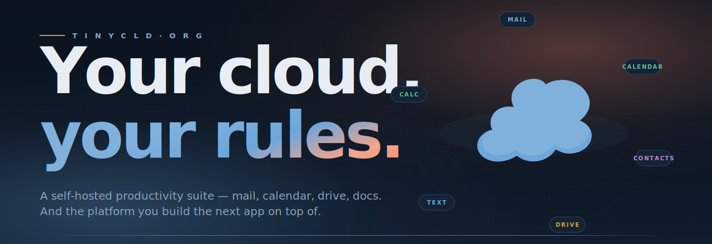

<div align="center">

<a href="https://tinycld.org">
    
</a>

<br/>

<a href="https://tinycld.org"></a>&nbsp;<a href="https://apps.apple.com/app/tinycld/id6762420971"></a>&nbsp;<a href="https://github.com/tinycld/tinycld/pkgs/container/tinycld"></a>&nbsp;<a href="https://github.com/tinycld/tinycld/blob/main/LICENSE"></a>

</div>

<br/>

> **A self-hosted productivity suite for your team — and the platform you build the next app on top of.**
> Standard protocols. Own your data. Free forever.

<br/>

<sub>━━━━━━━━━&nbsp;&nbsp;**01 / WHAT IT IS**&nbsp;&nbsp;━━━━━━━━━</sub>

TinyCld is a runnable **Workspace alternative** — mail, calendar, contacts, drive, documents, spreadsheets — that you boot on your own server and your team uses from the web, iOS, Android, or any client that speaks **IMAP, SMTP, CalDAV, CardDAV, or WebDAV**.

It's also the **package SDK** underneath: every app you see is a separately-installable sibling git repo that links into the shell. Fork one. Replace one. Write your own. The shell, the auth, the org model, the live-data layer, the push notifications, the audit log, the mobile build — those are the platform, and they're yours.

<br/>

<sub>━━━━━━━━━&nbsp;&nbsp;**02 / THE APPS**&nbsp;&nbsp;━━━━━━━━━</sub>

<table>
<tr>
<td width="33%" valign="top">

### ✉&nbsp;&nbsp;Mail
[`@tinycld/mail`](https://github.com/tinycld/mail)

Threaded inbox, labels, attachments, delivery tracking. Connect any IMAP or SMTP client.

<sub>**IMAP** · **SMTP**</sub>

</td>
<td width="33%" valign="top">

### 📅&nbsp;&nbsp;Calendar
[`@tinycld/calendar`](https://github.com/tinycld/calendar)

Shared calendars, recurring events, guest management, RSVP, reminders.

<sub>**CalDAV**</sub>

</td>
<td width="33%" valign="top">

### 👥&nbsp;&nbsp;Contacts
[`@tinycld/contacts`](https://github.com/tinycld/contacts)

Shared directory with favorites, notes, and org-wide sharing.

<sub>**CardDAV**</sub>

</td>
</tr>
<tr>
<td width="33%" valign="top">

### 📁&nbsp;&nbsp;Drive
[`@tinycld/drive`](https://github.com/tinycld/drive)

Versioned files, share links, role-scoped permissions, thumbnails, trash.

<sub>**WebDAV**</sub>

</td>
<td width="33%" valign="top">

### 📝&nbsp;&nbsp;Text&nbsp;&nbsp;<sub>`beta`</sub>
[`@tinycld/text`](https://github.com/tinycld/text)

A real document editor — not a textarea in a tab. Live CRDT collaboration, full-fidelity `.docx` and Markdown round-trips. Mobile-native.

</td>
<td width="33%" valign="top">

### 🔢&nbsp;&nbsp;Calc&nbsp;&nbsp;<sub>`beta`</sub>
[`@tinycld/calc`](https://github.com/tinycld/calc)

Spreadsheets that hold up on a phone. Formulas, named ranges, snapshots, real-time co-editing on top of Drive.

</td>
</tr>
</table>

<sub>Plus [`@tinycld/google-takeout-import`](https://github.com/tinycld/google-takeout-import) for one-shot migration of mail, calendar, contacts and drive from Google Workspace.</sub>

<br/>

<sub>━━━━━━━━━&nbsp;&nbsp;**03 / WHAT'S IN THE CORE**&nbsp;&nbsp;━━━━━━━━━</sub>

The shell every package leans on, so you write the feature and not the foundation.

|     | What it does | Looks like |
|:---:|:-------------|:-----------|
| 🔐 | **Auth** — sessions, signup, login, OAuth-ready | `useAuth()` |
| 🏢 | **Multi-org** — users in many orgs, per-org roles, org-scoped routes | `useOrgInfo()` |
| ⚡ | **Live data** — TanStack DB on PocketBase, reactive everywhere | `useOrgLiveQuery(...)` |
| 🔁 | **Mutations** — optimistic updates with rollback, generator-based | `useMutation({ ... })` |
| 📨 | **Email** — transactional + IMAP/SMTP serving in one config | `mailer.Send(ctx, msg)` |
| 🔔 | **Notifications** — one in-app feed for every package event | `notify({ ... })` |
| 📱 | **Expo Push** — native iOS + Android push, per-user device tokens | `push.SendToUser(...)` |
| 📜 | **Audit log** — append-only record of every change, browsable + exportable | `audit.Record(...)` |
| 🎨 | **Theming** — light + dark, semantic tokens, user-pickable palettes | `useThemeColor('foreground')` |
| 🌐 | **Web + native** — one codebase, Expo Router everywhere | `<Link href={orgHref(...)} />` |

<br/>

<sub>━━━━━━━━━&nbsp;&nbsp;**04 / PICK YOUR PATH**&nbsp;&nbsp;━━━━━━━━━</sub>

<table>
<tr>
<td width="50%" valign="top">

### 🛠 &nbsp;Operate

> *I want to run TinyCld for my team.*

```sh
# Clone the app shell — bundles @tinycld/core
git clone https://github.com/tinycld/tinycld.git
cd tinycld && npm install

# Link the apps you want
npm run packages:install \
    git@github.com:tinycld/mail.git
npm run packages:install \
    git@github.com:tinycld/calendar.git

# Boot the dev server
npm run dev
```

→ [Installation guide](https://tinycld.org/docs/installation)
→ [Docker image](https://github.com/tinycld/tinycld/pkgs/container/tinycld)
→ [Get it on iOS](https://apps.apple.com/app/tinycld/id6762420971)

</td>
<td width="50%" valign="top">

### ✦ &nbsp;Build

> *I want to write a package on top of it.*

```sh
# Scaffold a new package from scratch
npx @tinycld/create-package my-app

# It drops a sibling next to the shell with
# manifest, screens, collections, migrations,
# tests, and Go server stubs already wired in.

# Link it back in & run
cd ../tinycld
npm run packages:link my-app
npm run dev
```

→ [Getting started](https://tinycld.org/docs/getting-started)
→ [Anatomy of a package](https://tinycld.org/docs/anatomy/manifest)
→ [llms-full.txt](https://tinycld.org/llms-full.txt)

</td>
</tr>
</table>

<br/>

<sub>━━━━━━━━━&nbsp;&nbsp;**05 / WHERE EVERYTHING LIVES**&nbsp;&nbsp;━━━━━━━━━</sub>

<table>
<tr>
<td valign="top">

**App shell + bundled core**
- [`tinycld`](https://github.com/tinycld/tinycld) — Expo + PocketBase shell, ships `@tinycld/core` inside

**Feature apps**
- [`mail`](https://github.com/tinycld/mail) — `@tinycld/mail`
- [`calendar`](https://github.com/tinycld/calendar) — `@tinycld/calendar`
- [`contacts`](https://github.com/tinycld/contacts) — `@tinycld/contacts`
- [`drive`](https://github.com/tinycld/drive) — `@tinycld/drive`
- [`text`](https://github.com/tinycld/text) — `@tinycld/text`
- [`calc`](https://github.com/tinycld/calc) — `@tinycld/calc`

</td>
<td valign="top">

**Tooling & infra**
- [`create-package`](https://github.com/tinycld/create-package) — scaffolding CLI for new packages
- [`utils`](https://github.com/tinycld/utils) — deploy tree, infra, ecosystem helpers
- [`google-takeout-import`](https://github.com/tinycld/google-takeout-import) — one-shot Workspace migration

**Web**
- [`web`](https://github.com/tinycld/web) — the marketing site and docs at [tinycld.org](https://tinycld.org)

</td>
</tr>
</table>

<br/>

<sub>━━━━━━━━━&nbsp;&nbsp;**06 / BUILT WITH**&nbsp;&nbsp;━━━━━━━━━</sub>

<p>


</p>

<br/>

<div align="center">
<sub>━━━━━━━━━━━━━━━━━━━━━━━━━━━━━━━━━━━━</sub>

**[tinycld.org](https://tinycld.org)** &nbsp;·&nbsp; **[docs](https://tinycld.org/docs)** &nbsp;·&nbsp; **[support](https://tinycld.org/support)** &nbsp;·&nbsp; **[privacy](https://tinycld.org/privacy)**

<sub>Made for teams who'd rather own the cloud than rent it.</sub>
</div>
